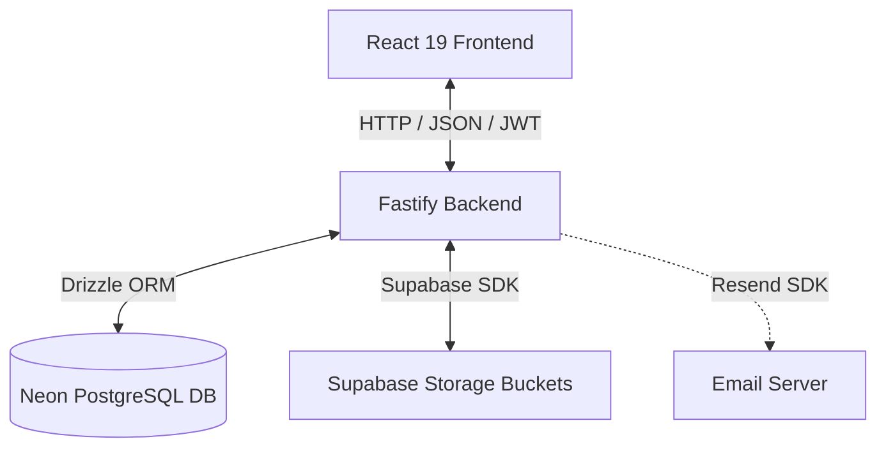

# AssetFlow: Enterprise Asset & Resource Management System

AssetFlow is a production-grade, enterprise-scale resource and asset tracking platform. It simplifies and digitizes how organizations manage physical assets, equipment, software licenses, shared facilities, and maintenance lifecycles in a single centralized ERP.

Built with a high-performance **Fastify & Drizzle ORM (PostgreSQL)** backend and a rich, responsive **React 19 & Tailwind CSS v4** frontend.

---

## 🚀 System Architecture



---

## ✨ Features Overview

The platform provides role-based workspaces and addresses the full lifecycle of company assets and resources across 10 functional modules:

### 1. **Login & Signup**
*   Credentials-based secure login (`email` & `password`) with BCrypt hashing and JWT session validation.
*   **Role-Based Security (RBAC)**: Signup registers users with the default `Employee` role. Administrative promotion from the employee directory is the exclusive channel to assign `Asset Manager` or `Department Head` access.

### 2. **Operational KPI Dashboard**
*   Real-time metrics tracking: Available Assets, Allocated Assets, Ongoing Maintenance, Active Bookings, and Overdue Returns.
*   Highlights **Overdue Returns** (past Expected Return Date) to distinguish them from regular active check-outs.
*   Quick Action panel to register assets, schedule resource bookings, or request maintenance on the fly.

### 3. **Organization Setup (Admin Only)**
*   **Department Management**: Create, edit, and hierarchically organize parent/child departments. Assign Department Heads.
*   **Asset Category Management**: Create custom categories (e.g., Electronics, Furniture, Software) with flexible configurations.
*   **Employee Directory**: Central database of employee details (name, email, department, role, status) with admin controls to promote/degrade user privileges.

### 4. **Asset Directory & Registration**
*   Details catalog: Auto-generated unique Asset Tags (`AF-0001`), serial numbers, acquisition date, acquisition cost, physical location, and current condition check.
*   Support for multiple attachments (photos/documents) per asset backed by Supabase Storage.
*   Custom toggle to mark assets as "shared/bookable" resources.
*   Full search and filters by Asset Tag, Category, Status, Department, or Location.
*   Per-asset lifecycle history tracing audit logs, allocations, and maintenance cycles.

### 5. **Asset Allocation & Transfers**
*   Allocate assets to individual Employees or entire Departments with optional Expected Return Dates.
*   **Double-Allocation Prevention**: Checks database status to block overlapping allocations. If the asset is already taken, a **Transfer Request** workflow is triggered.
*   **Transfer Workflow**: `Requested` ➔ `Approved` (by Asset Manager or Department Head) ➔ `Re-allocated` (history updated automatically).
*   **Return Flow**: Mark returned, input condition check-in notes, and restore the asset status to `Available`.

### 6. **Resource Booking (Calendar & Overlaps)**
*   Interactive scheduler to book shared facilities, conference rooms, vehicles, or equipment.
*   **Time-Slot Overlap Validation**: Automated checks block double-bookings for the same slot.
*   Booking states: `Upcoming` ➔ `Ongoing` ➔ `Completed` / `Cancelled`.

### 7. **Maintenance & Repair Flow**
*   Employees raise tickets with descriptions, priorities (`Low`, `Medium`, `High`, `Critical`), and optional photo uploads.
*   Workflow: `Pending` ➔ `Approved` / `Rejected` (by Asset Manager) ➔ `Technician Assigned` ➔ `In Progress` ➔ `Resolved`.
*   Asset state flips to `Under Maintenance` on approval and reverts back to `Available` on resolution.

### 8. **Asset Auditing cycles**
*   Administrators create Audit Cycles (scope scoped by department or location) and assign auditors.
*   Auditors update asset records: `Verified`, `Missing`, or `Damaged`.
*   **Discrepancy Reporting**: Auto-generates reports for flagged assets.
*   Closing the Audit Cycle locks logs and automatically updates asset statuses (e.g., updates missing items to `Lost`).

### 9. **Reports & Analytics**
*   Utilization graphs showing most active vs. idle resources.
*   Maintenance frequencies and high-risk categories.
*   Resource booking heatmaps indicating peak hours.

### 10. **Activity Logs & Notifications**
*   Notification alerts for check-ins, transfers, overdue alerts, and audit flags.
*   Immutable activity log tracking every administrative, management, and employee action.

---

## 🛠️ Technology Stack

### Backend
*   **Framework**: Fastify (Node.js >= 22)
*   **Database ORM**: Drizzle ORM
*   **Database**: Neon PostgreSQL
*   **Authentication**: JWT Token payload & bcryptjs
*   **File Storage**: Supabase Storage JS Client
*   **Mailing**: Resend API
*   **Logger**: Pino Logger
*   **Validation**: Zod Schemas

### Frontend
*   **Framework**: React 19
*   **Build Tool**: Vite
*   **Styling**: Tailwind CSS v4 (using the `@tailwindcss/vite` plugin compiler)
*   **State Management**: React Context (`AppContext.tsx`) & Custom Hooks
*   **Routing**: React Router DOM v7
*   **Icons**: Lucide React

---

## 📂 Project Structure

```text
Asset-Ops/
├── AssetOps-Backend/             # Fastify Backend Service
│   ├── src/
│   │   ├── db/
│   │   │   ├── connection.ts     # DB client & pool configs
│   │   │   ├── schema.ts         # DB Schema definitions & enums
│   │   │   └── seed.ts           # Pre-population seeding script
│   │   ├── handlers/
│   │   │   └── api.ts            # Fastify App entry point
│   │   ├── lib/
│   │   │   └── logger.ts         # Pino logger configuration
│   │   ├── plugins/
│   │   │   ├── auth.ts           # Route guard and authentication hooks
│   │   │   └── dbErrorHandler.ts # SQL error mapping
│   │   ├── routes/               # API endpoint modules
│   │   │   ├── organization-setup/
│   │   │   └── ...
│   │   ├── services/             # Core business logic handlers
│   │   └── utils/
│   │       ├── authUtils.ts
│   │       └── dbRetry.ts
│   ├── drizzle.config.ts         # Drizzle configuration file
│   └── package.json
│
└── AssestOps-Frontend/           # React Frontend Application
    ├── src/
    │   ├── assets/               # SVGs and images
    │   ├── components/           # UI, sidebar, layout elements
    │   ├── contexts/             # React App context providers
    │   ├── hooks/                # Hooks for communicating with API
    │   ├── pages/                # Screen view pages
    │   │   ├── OrgSetup/         # Dept, Category, Employee setup
    │   │   ├── ResourceBooking/  # Resource calendar & schedules
    │   │   └── ...
    │   ├── store/                # UI stores
    │   ├── types/                # Shared TypeScript models
    │   ├── utils/                # HTTP fetch clients & upload helpers
    │   ├── App.tsx               # Main routing & gate component
    │   └── index.css             # Tailwind v4 directives & custom tokens
    ├── tailwind.config.js
    └── package.json
```

---

## ⚙️ Getting Started

### Prerequisites
*   Node.js (version 22 or higher)
*   PostgreSQL Database (e.g. local PG instance or a Neon DB connection)
*   Supabase Account (for media file storage)

---

### Step 1: Backend Setup

1.  Navigate into the backend directory:
    ```bash
    cd AssetOps-Backend
    ```
2.  Install dependencies:
    ```bash
    npm install
    ```
3.  Configure the environment variables. Copy `.env.example` to `.env`:
    ```bash
    cp .env.example .env
    ```
    Provide configuration values in `.env`:
    *   `DATABASE_URL`: Your Postgres/Neon connection string
    *   `JWT_SECRET`: Secret key for authentication tokens
    *   `SUPABASE_URL` & `SUPABASE_SERVICE_ROLE_KEY`: Supabase API configurations
4.  Push the schema and seed the database with production-grade template data:
    *   Push schema to DB:
        ```bash
        npx drizzle-kit push
        ```
    *   Seed default tables:
        ```bash
        npm run seed
        ```
5.  Start the backend API server:
    ```bash
    npm run dev
    ```
    The server will start running on `http://localhost:3000`.

---

### Step 2: Frontend Setup

1.  Navigate to the frontend directory:
    ```bash
    cd ../AssestOps-Frontend
    ```
2.  Install dependencies:
    ```bash
    npm install
    ```
3.  Create an `.env` file (optional, if you run the backend on a port other than `3000`):
    ```env
    VITE_API_URL=http://localhost:3000/api
    ```
4.  Launch the Vite development server:
    ```bash
    npm run dev
    ```
    By default, this will run on `http://localhost:5173`. Open this URL in your web browser.

---


## 📡 API Reference Overview

The Fastify server exposes the following endpoint routes:

| Route Path | Method | Description | Guard |
| :--- | :--- | :--- | :--- |
| `/api/login` | `POST` | Authenticate credentials & retrieve JWT token | None |
| `/api/health` | `GET` | Health check verifying database availability | None |
| `/api/dashboard` | `GET` | Retrieve metrics, KPIs, and overdue return counts | JWT Auth |
| `/api/assets` | `GET` / `POST` | List registered assets / Register new assets | JWT Auth |
| `/api/assets/:id` | `GET` / `PUT` | View single asset lifecycle / Update details | JWT Auth |
| `/api/allocations` | `POST` | Allocate asset to employee or department | JWT Auth |
| `/api/transfers` | `GET` / `POST` | View requests / Request transfer for taken asset | JWT Auth |
| `/api/transfers/:id/approve`| `POST` | Approve/reject asset transfers | JWT Auth |
| `/api/bookings` | `GET` / `POST` | View calendar schedule / Book a shared resource | JWT Auth |
| `/api/maintenance` | `GET` / `POST` | List active maintenance / Raise repair ticket | JWT Auth |
| `/api/audits` | `GET` / `POST` | List audits / Create new audit cycles | JWT Auth |
| `/api/organization-setup/...`| `GET` / `POST` | Manage departments, categories, and directories | Admin Only |